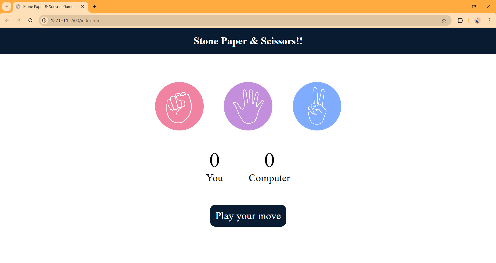
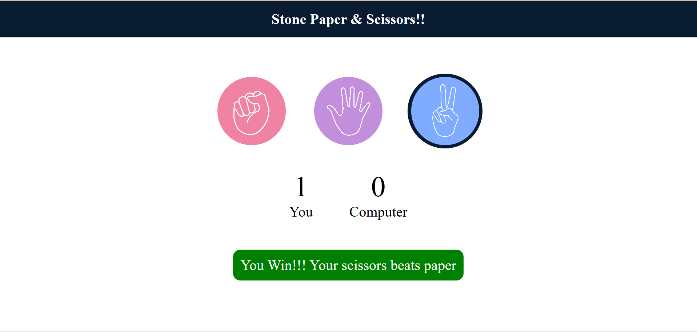
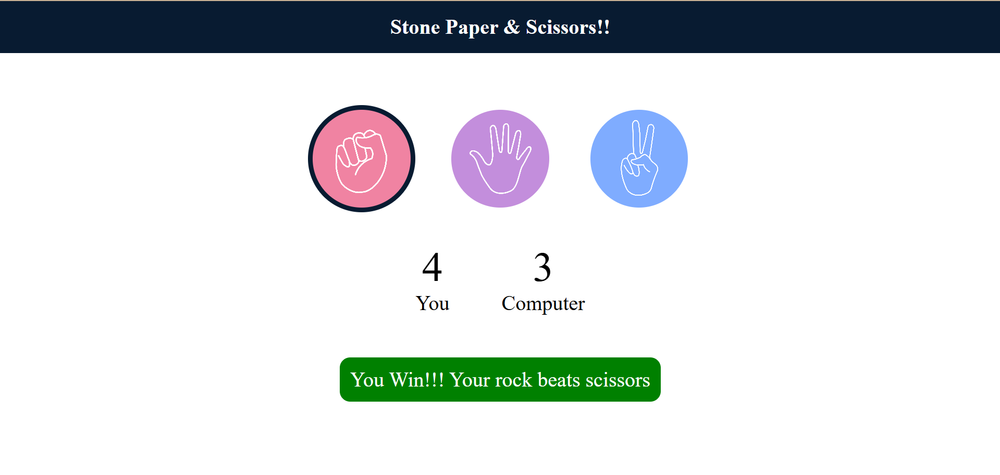

# Rock-Paper-Scissors Mini Project Game using HTML, CSS & JavaScript

This project is a fully functional **Rock-Paper-Scissors** game built using **HTML5**, **CSS3**, and **Vanilla JavaScript**. It features a sleek and responsive user interface, real-time score updates, and engaging visuals. Ideal for beginners to intermediate developers looking to practice core front-end skills and basic game logic.

---

### 🎮 Classic Game Mechanics:
- Choose between Rock 🪨, Paper 📄, or Scissors ✂️.
- The computer selects its move randomly.
- Scores are updated live on each round.
- A result message displays who won or if it’s a draw.

---

### 💡 Frontend + Logic:
- Built with HTML/CSS for structure and styling.
- JavaScript handles game logic, randomization, score tracking, and DOM manipulation.
- Uses event listeners for interactivity and dynamic UI changes.

---

### 🎨 Modern UI Design:
- Clean, minimal, and responsive design.
- Smooth hover and click animations.
- Highlights the selected move with borders.
- Color-coded result message box for win/loss/draw feedback.

---

## 📽️ Demo Video

[🎬 Click here to watch the demo video](./demoRec.mp4)

---

## 📸 Screenshots

### 🏠 Homepage (Before Game Starts)

### ✊ Player Selected Rock — Game In Progress

### 🏆 Winning Message Displayed

---

## 📁 Project Structure
│
├── index.html → Main HTML structure
├── style.css → CSS styles for layout and animations
├── script.js → JavaScript logic for the game
├── README.md → Project description and documentation
├── demoRec.mp4 → Gameplay demo video
├── Screenshot1.png → Homepage screenshot
├── Screenshot2.png → Game in progress screenshot
├── Screenshot3.png → Win result screenshot
└── images/ → (Optional folder for additional images if used)

